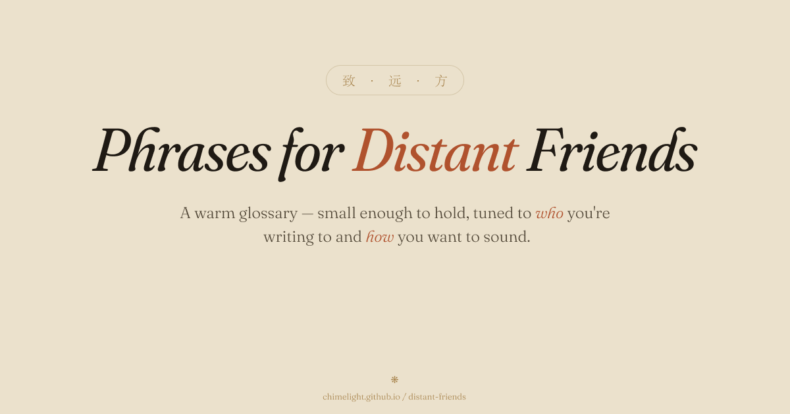

# 致 · 远 · 方 · Distant Friends

> A warm multilingual glossary of friendly phrases — for keeping in touch with friends across languages.

[Live (Pages)](https://chimelight.github.io/distant-friends/) · [Preview (Vercel)](https://distant-friends.vercel.app)



## What it is

A small, hand-curated phrase glossary covering everyday friendly turns — greetings, catching up, reactions, questions, gratitude, compliments, encouragement, affection, wishes, holidays, farewells — across twenty-three languages (63 phrases), extensible. Click any cell to copy, hover for a speak button (Web Speech API, when the browser has a matching voice), star the phrases you reach for and filter to them. Switch the anchor language at any time. Tune the tone (`in any tone` / `casually` / `evenly` / `politely`) and set who is writing to whom (`as a man/a woman`, `to him/her`) — gendered languages then show only the forms that fit; remaining distinctions surface as quiet tag-line labels. Installable as a PWA; the whole glossary works offline.

What it isn't:

- Not a travel phrasebook ("how do I get to the airport")
- Not a language learning tool (no quizzes, no SRS)
- Not a translator (no translation API)

## Stack

Astro 7 + Svelte 5 + TypeScript (strict) + nanostores (with `@nanostores/persistent`) + Zod + vanilla CSS. PWA via `@vite-pwa/astro`. Self-hosted Fraunces + Instrument Sans + Noto Serif CJK. No Tailwind, no UI library, no CSS-in-JS.

Design source of truth: [DESIGN.md](DESIGN.md).

## Local development

```bash
pnpm install
pnpm dev          # http://localhost:4321/distant-friends/
pnpm build        # static output → dist/
pnpm check        # type + svelte check
pnpm coverage     # phrase × language coverage matrix
pnpm new-phrase   # interactive scaffolder for a new phrase
```

Requires Node 22+ and pnpm 9 (pinned via `packageManager`; corepack picks it up automatically).

## Project structure

```
src/
├── components/
│   ├── astro/        # static — Layout, Masthead, Footer, Legend
│   └── svelte/       # interactive islands — Stationery, Phrase*, Toc*, …
├── content/ui/       # UI strings (English only for now)
├── data/
│   ├── languages.json
│   ├── scenes.json
│   ├── phrases.ts    # aggregates phrases/ via import.meta.glob
│   └── phrases/      # one JSON file per phrase — 63 phrases × 23 languages
├── lib/              # schema (Zod), filter, stores, tts, scroll, clipboard, storage
├── pages/            # index + 404
└── styles/           # tokens.css (light + dark), global.css, typography.css
```

## Adding content

All content lives in `src/data/`: `languages.json`, `scenes.json`, and one JSON file per phrase under `phrases/`. Schema is enforced at build time by Zod (`src/lib/schema.ts`); a malformed entry fails `pnpm build`.

### Add a phrase

Create `src/data/phrases/<id>.json`:

```jsonc
{
  "id": "kebab-case-id",
  "scene": "one of the ids in scenes.json (greetings, reactions, questions, …)",
  "order": 1,
  "trans": {
    "zh": {
      "gloss": "汉语对这个概念的小标签",
      "variants": [
        { "text": "你好", "rom": "nǐ hǎo" }
      ]
    }
    // …one block per language
  }
}
```

Or run `pnpm new-phrase` for an interactive scaffolder that fills the structure.

Variant fields:

| field | required | notes |
| --- | --- | --- |
| `text` | ✓ | the translation |
| `rom` |   | romanization, only for non-Latin scripts |
| `tone` |   | `casual` / `neutral` / `polite` — fill **only when the language draws a real distinction** at that level |
| `speakerGender` |   | `m` / `f` (e.g. Portuguese `Obrigado` / `Obrigada`) |
| `addresseeGender` |   | `m` / `f` (e.g. Spanish `amigo` / `amiga`) |
| `addresseeCount` |   | `one` / `many` (e.g. "Bye everyone" → `many`) |
| `region` |   | `BR` / `PT` / `MX` etc, only when meaningful |
| `note` |   | freeform English commentary |

### Add a language

1. Append a row to `src/data/languages.json` (`code`, `native`, `tts`, `rtl`, `defaultOn`, `defaultAnchor`).
2. Translate every phrase's `trans` block to add the new code.
3. Run `pnpm coverage` to verify fill rate.

### Add a scene

Append to `src/data/scenes.json` and use the new `id` in any phrase's `scene` field. Reorder the array to reorder the page.

## Translation philosophy

Four rules behind every variant:

1. **Warmth before grammar.** A phrase that sounds like a friend wins over the textbook-correct one.
2. **Fill only real distinctions.** Don't tag every variant with `tone: neutral` — leave `tone` unset if the language doesn't actually distinguish at that level.
3. **Friendly foreigner, not fake native.** The sender is reaching out in a language they don't speak. Variants should be warm and standard — deep slang or buddy-register ("bro" energy) reads as fake fluency and lands wrong coming from a foreign friend. Chat conventions everyone learns on day one (jajaja, ㅋㅋㅋ, 555, wkwk) are fine.
4. **Every variant must earn its seat.** Most phrases have countless casual paraphrases; listing several synonyms reads as noise, not coverage. A second variant exists only for a grammatical split (gender, politeness), a genuinely different function, or a fixed expression every native reaches for. One canonical form beats a sample of alternatives. When trimming a synonym pair, the **standard/textbook form survives** and the casual duplicate goes — every cell keeps a neutral default ("I'm fine" before "I'm good"), unless the concept itself has no formal register (cool, oops, chat laughter).

Translation drafts are produced in pair-programming with Claude. AI drafts have shipped wrong gender forms, wrong politeness levels, and direct-translated English idioms in the past — `pnpm review` exports a side-by-side HTML table to make spot-checking easy.

## Deploy

Two environments, both protected branches (PR-only):

| branch | host | trigger | URL |
| --- | --- | --- | --- |
| `release` | GitHub Pages | PR merge from `main` | https://chimelight.github.io/distant-friends/ |
| `main` | Vercel | PR merge from `dev` | https://distant-friends.vercel.app |

Working branch is `dev`. To ship:

```
dev → PR → main          (Vercel rebuilds preview)
main → PR → release      (Pages rebuilds + GitHub Release + Discord notify)
```

The release flow is wrapped in a `/release` slash command (Claude Code) that drafts notes, creates a tagged GitHub Release, and posts a Discord embed.

### Dependency updates

Fully automated — no hand-polling, no manual review. Dependabot opens PRs against `dev` weekly (`.github/dependabot.yml`); a workflow (`.github/workflows/dependabot-auto-merge.yml`) runs `pnpm build` + `pnpm check` and squash-merges any PR that passes — **patch, minor, and major alike**.

- **minor + patch** bumps are bundled into one PR.
- **major** bumps arrive as separate PRs (so one breaking major can't block the rest) but auto-merge the same way once green.
- the build + type-check is the **only** gate: anything that fails to compile or type-check stays open instead of merging.

Updates enter at `dev`, so they still ride the `dev → main → release` pipeline (and its Vercel/Pages preview builds) before reaching production. The config is read from the default branch (`main`).

## Roadmap

Canonical task list with checkboxes: [DESIGN.md §11](DESIGN.md#11-里程碑与任务清单). The table below is a summary and may lag.

**v1.0.0 shipped 2026-06-12** — all core milestones done; remaining items are verification (offline test, axe sweep, cross-browser matrix — see DESIGN §11 / Appendix F).

| Milestone | State |
| --- | --- |
| M0 — project skeleton | ✅ v0.1.0 |
| M1 — visual + interactive parity with v3 demo | ✅ v0.1.0 |
| M2 — dark mode + starring | ✅ v0.2.0 / v1.0.0 |
| M3 — TTS + PWA | ✅ v1.0.0 (offline field test pending) |
| M4 — polish (a11y, Lighthouse, 404) | Lighthouse 88/100/100/100 within budget; axe + manual browser matrix pending |
| M5 — content (ongoing) | 23 languages × 63 phrases, fully audited (see Translation philosophy) |
